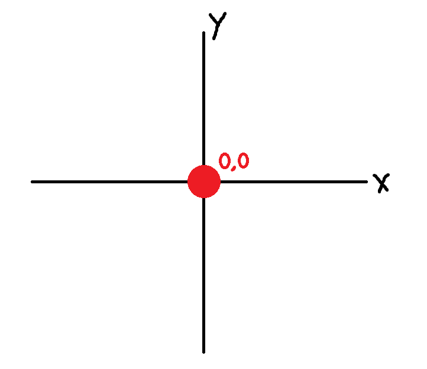

# Mars Rover
## Preface
Mars Rover is a well known code kata that is regularly used to test the development skills of developers during interviews. In this exercise you will create a Mars Rover that can do any number of things. What it does is irrelevant. How it is implemented is what matters. That is the purpose of this code kata.

## Our goal
The goal is to write a mars rover application using the TDD (test driven design) principles. Red - Green - Blue. Also known as "fail, pass, refactor".

For each feature we add, we will make sure we write a test first. This test will fail because we will write it before implementing the business logic. Then we make the test pass by implementing the business logic. And finally, we will refactor as we see fit.

## Scope
We will write an application for a Mars Rover, seen as 'top-down' on a graph where the horizontal axis is the X-axis and the vertical axis is the Y-axis. North facing would be positive on the X-axis, east facing would be positive on the Y-axis, etc.

The mars rover should:
- be able to report it's coordinate
- be able to report it's facing direction
- be able to move forwards
- be able to move backwards
- be able to turn left
- be able to turn right

_Optionally it should be able to_
- _be able to change it's speed_
- _be able to strafe to the left_
- _be able to strafe to the right_
